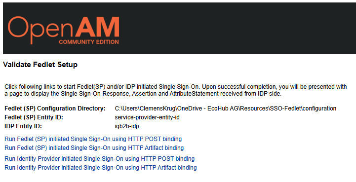
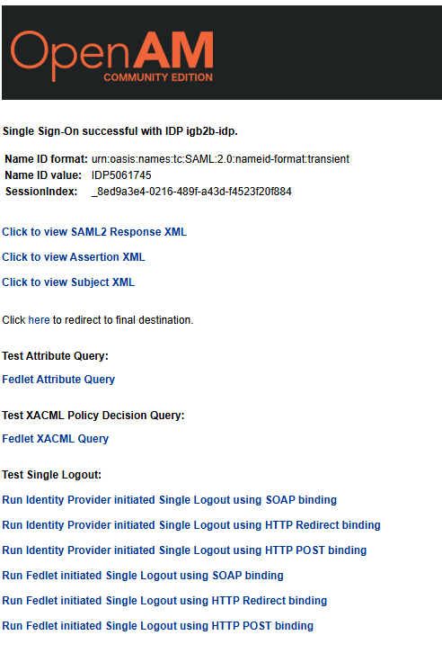

# EcoHub SAML SSO Service Provider Reference Implementation

This repository contains a reference implementation of a Service Provider (SP) for Single Sign-On (SSO) using the SAML 2.0 protocol, tailored for EcoHub's Identity Provider (IDP). This implementation leverages the Fedlet from OpenAM, a popular open-source access management solution.

The implementation allows you to test the IdP-initiated flow from the service provider perspective. The SP initiated flow is not supported.

**WARNING: This repository can be used as a starting point to play around and get more familiar with SAML SSO. However, the fedlet has not been fully configured 
and some / most features won't work correctly. EcoHub does not provide any support for using this repository. Feel free
to provide pull requests for missing / incorrect configurations.**

## Prerequisites

- Apache Tomcat 9.x
- IntelliJ Idea. Running the fedlet without IntelliJ is possible, but you'll have to manually recreate the conditions of the provided run configuration.
- Basic understanding of SAML 2.0, Identity Provider (IDP), and Service Provider (SP) configuration
- Understanding of how to setup the Insurer and Broker on EcoHub to test the SSO access.

## Repository Structure

- **/OpenAM**  
  Contains the original Fedlet and configuration templates from OpenAM. 
  The files have been downloaded from [OpenAM 15.1.0 Release](https://github.com/OpenIdentityPlatform/OpenAM/releases/tag/15.1.0)  
  The original README contains extensive information regarding the fedlet and it's configuration.

- **/configuration**  
  Contains the EcoHub-specific configuration files, including metadata and properties for integrating with the EcoHub IDP.

## Run Configuration

1. **Configure Tomcat**  
   - Make sure Tomcat is accessible under 'localhost:8080'
   - Set com.sun.identity.fedlet.home to the /configuration directory of this repository.
   
2. **Deploy to Tomcat**  
     Make sure the OpenAM/fedlet.war is deployed to Tomcat and is accessible under localhost:8080/fedlet_war.

3. **Configure host file (windows)**  
  - The service provider configuration at EcoHub only allows valid URLs for the service provider endpoint, 
  thus 'localhost' is not a valid value. To work around this on windows, configure your hosts file
  to resolve 'localhost.ch' to 127.0.0.1.
  - If you're not on windows, find the equivalent option on your system to redirect http://localhost:8080 to localhost.

## Configure the Service Provider on EcoHub

The configuration of your service provider must match the configuration used in the fedlet. Configure your service provider in EcoHub as follows:
- Assertion Consumer Service Endpoint: http://localhost.ch:8080/fedlet_war/fedletapplication
- Sign-in Algorithm: RSA_SHA1
- Assertion Consumer Binding Type: Http Post
- Audience: service-provider-entity-id

## Running the Service Provider

Once everything is configured:

1. Start your Tomcat server.
2. Access the SP at `http://localhost:8080/fedlet_war`. You should see this page:

3. Clicking any of the provided links won't work. Instead, head to EcoHub, login as the Broker and 
  access the insurer portal from the portal page. If everything has been setup correctly, you'll be
  redirected to your fedlet from where you can view the SAMLResponse:
  

## Contributions

Feel free to fork this repository, submit issues, and create pull requests. Contributions are welcome!
